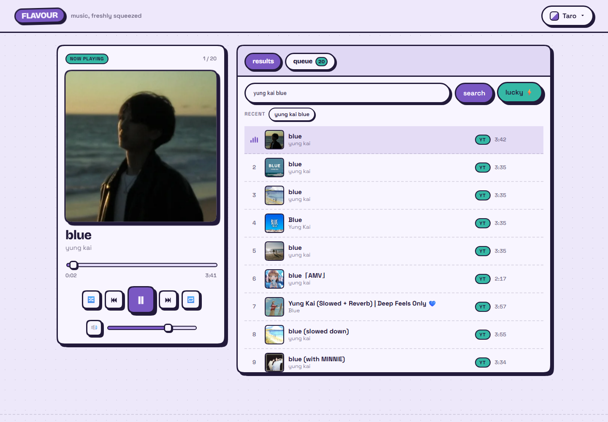
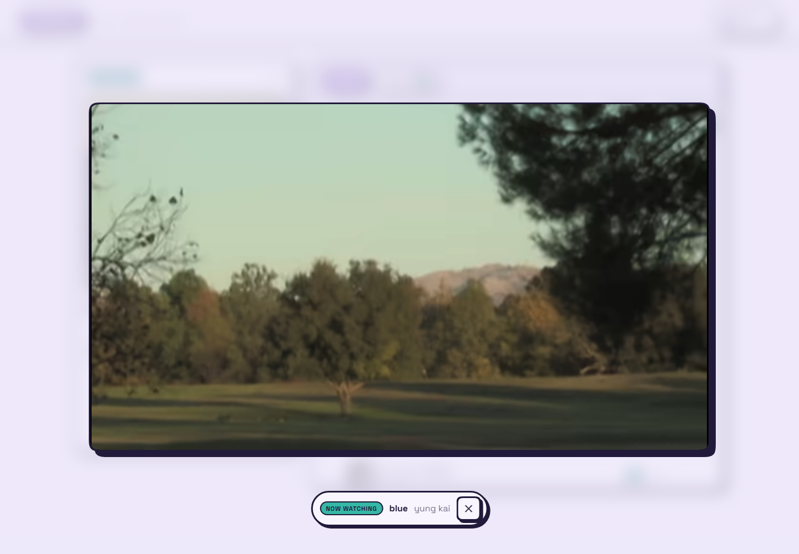
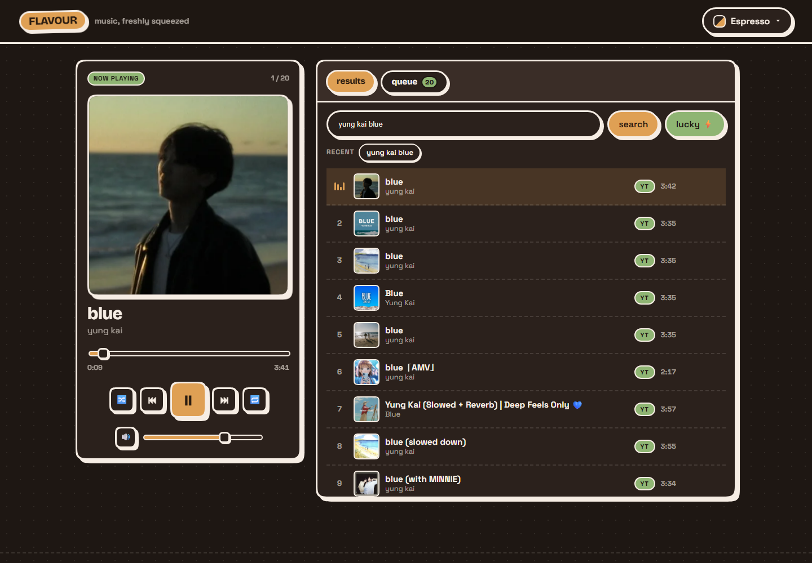

# 🍵 FLAVOUR

**Music, freshly squeezed.** A flavourful YouTube-powered music player — search anything, play it like a real music app, and the video stays out of the way until you want it.

Born from a simple problem: no Spotify at work, but YouTube works fine.



## Features

- **Search anything on YouTube** — keyless, powered by YouTube Music's internal API (clean artist / title / duration / square album art), with a regular YouTube fallback for the long tail
- **Lucky ⚡** — plays the top hit immediately, `"artist - song"` style queries just work
- **Real player feel** — queue, play-next, shuffle, repeat, seek, volume, keyboard shortcuts
- **Hidden playback** — the video runs behind the scenes at 320×180, so it stays audio-first
- **Immersive mode** — one press and the *same* video animates into a big squircle frame. Never reloads, never interrupts the audio
- **OS media controls** — Media Session API gives you working media keys and title/artist/artwork in the system media hub
- **8 flavours** — Matcha, Pistachio, Taro, Mango, Blueberry, Strawberry, Espresso, Vanilla
- **Persistence** — queue, volume, shuffle/repeat and flavour survive reloads (localStorage)

| Immersive mode | Espresso, late night |
| --- | --- |
|  |  |


## Stack

- **SvelteKit** (Svelte 5 runes) + TypeScript
- **Plain CSS design system** (`src/app.css`) — smooth neo-brutalism: chunky ink borders, hard offset shadows, squircle corners (`corner-shape`)
- **YouTube IFrame Player API** for playback, one player instance, two layouts
- **`youtubei.js`** in the server route `/api/search` — keyless search, edge-cached
- **Vercel** for hosting (adapter-vercel)

## Getting started

```bash
npm install
npm run dev      # http://localhost:5173
npm run check    # types + svelte diagnostics
```

No API keys, no `.env`, no accounts needed to run it.

## Keyboard shortcuts

| key | action |
| --- | --- |
| `space` / `k` | play / pause |
| `←` `→` | seek ±5s |
| `↑` `↓` | volume |
| `n` / `p` | next / previous track |
| `m` | mute |
| `f` | toggle immersive mode |
| `/` | focus search |
| `esc` | leave immersive mode |

## Project layout

```
src/
├── app.css                     # design tokens, 8 flavour palettes, brutalist primitives
├── app.html                    # fonts + no-flash theme bootstrap
├── lib/
│   ├── components/             # NowPlaying, SearchPanel, ResultsList, QueuePanel,
│   │                           # MiniPlayer, VideoDock, FlavourPicker, Toaster
│   ├── player.svelte.ts        # the player controller: queue + transport + YouTube wiring
│   ├── search.svelte.ts        # client search state
│   ├── theme.svelte.ts         # flavour switching + persistence
│   ├── mediaSession.ts         # OS media controls
│   ├── format.ts               # time formatting, title cleanup
│   ├── flavours.ts             # flavour metadata
│   └── yt/loader.ts            # one-time IFrame API loader + minimal typings
└── routes/
    ├── +layout.svelte          # shell, keyboard shortcuts, persistent video dock
    ├── +page.svelte            # home: now playing + browse panel
    └── api/search/+server.ts   # keyless search endpoint (YouTube Music + fallback)
```

## Deploying to Vercel

1. Push this folder to a GitHub repository
2. On [vercel.com](https://vercel.com) → **Add New → Project** → import the repo
3. Framework preset is auto-detected as SvelteKit. No environment variables needed
4. Deploy — every push to `main` redeploys automatically

The `/api/search` route becomes a Vercel function, and search responses are cached at the edge for an hour (`s-maxage=3600`).

### Local builds on Windows

`npm run build` finishes the Vite build and then runs the Vercel adapter, which creates a symlink that Windows blocks unless **Developer Mode** is on (Settings → System → For developers). Deployment is unaffected (Vercel builds on Linux) and `npm run dev`, `npm run check` and the screenshot scripts all work locally either way.

## How the keyless search works

`/api/search` posts to YouTube's internal `youtubei/v1/search` using the `WEB_REMIX` (YouTube Music) client via `youtubei.js`:

- no Google Cloud project, no API key, no daily quota
- returns proper `artist` / `title` / `duration` instead of raw video titles, plus square album art
- falls back to a regular YouTube video search when a song isn't in the music catalogue
- it's unofficial, so if YouTube changes things, use the diagnostics below

There's also a small import map: `src/lib/yt/loader.ts` wraps the IFrame API with just the typings FLAVOUR uses.

## Notes and known quirks

- **Ads** still play inside the embed, and they can't be skipped while the player is hidden. An adblocker or a signed-in Premium session helps
- Embed-restricted / region-blocked videos are **skipped automatically** with a toast
- **Mobile browsers** may pause background playback when the screen locks — that's a browser limitation, not the app
- Album art sets `referrerpolicy="no-referrer"`: some YouTube CDN images reject unknown referrers
- `static/robots.txt` disallows indexing — this is a personal toy, not a public service

## Dev scripts

| command | what it does |
| --- | --- |
| `npm run shots` | desktop smoke test (search → play → immersive → queue → flavours) + screenshots into `screenshots/` |
| `npm run shots:mobile` | the same flow at phone size |
| `node scripts/debug-play.mjs "query"` | playback diagnosis: state polling + console + failed requests |
| `node scripts/check-art-browser.mjs "query"` | album art diagnosis (referrer / size issues) |

Set `CHROME_PATH` if Chrome/Edge isn't in the default location.

## Ideas for later

- PWA install with an offline shell
- Floating always-on-top player via Document Picture-in-Picture
- Paste a YouTube link (or playlist) to import
- Voice search — "play <song> by <artist>"
- Lyrics panel, sleep timer, crossfade-ish transitions
