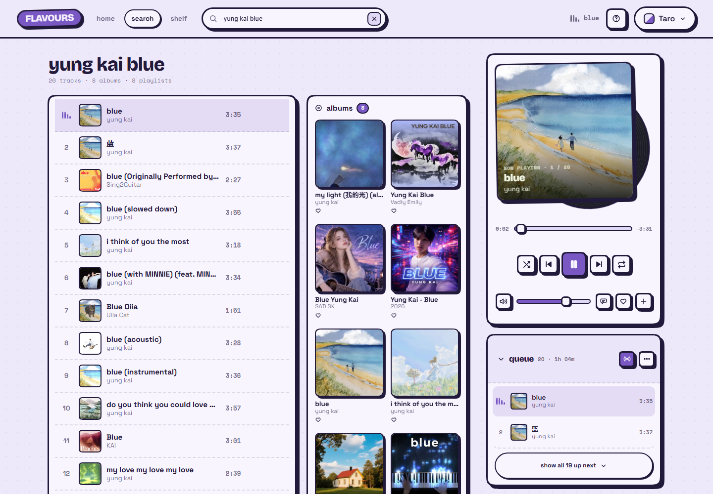
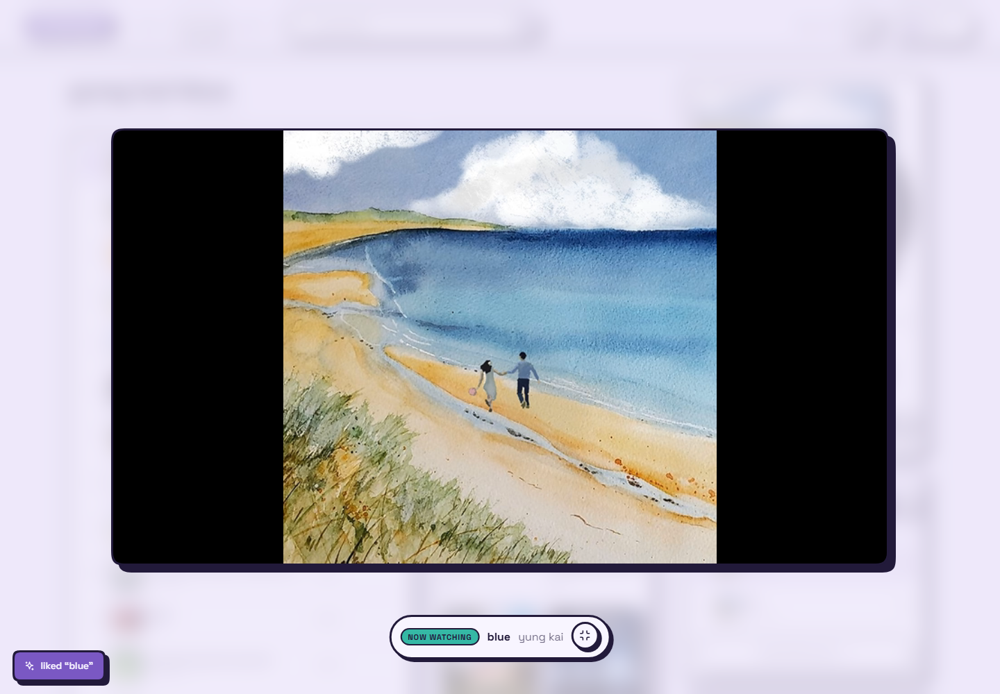
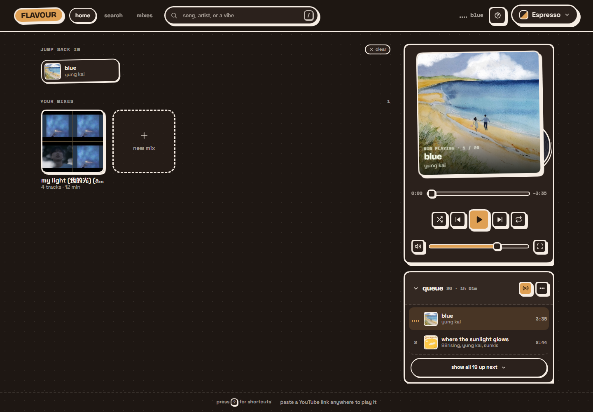
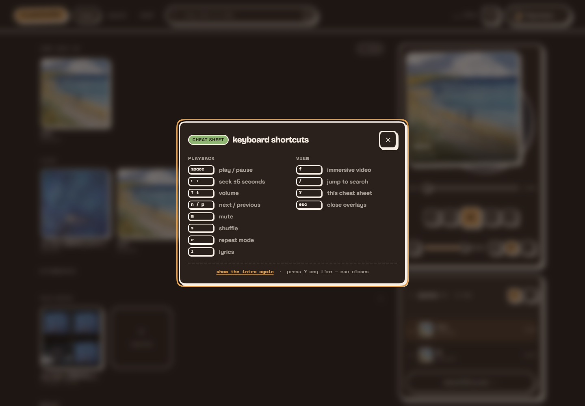
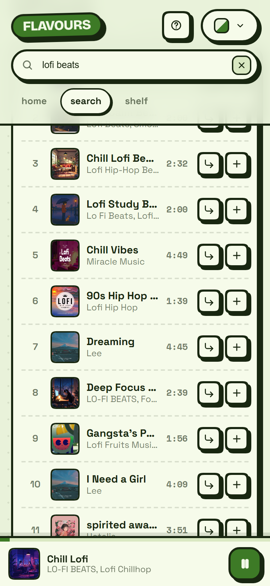
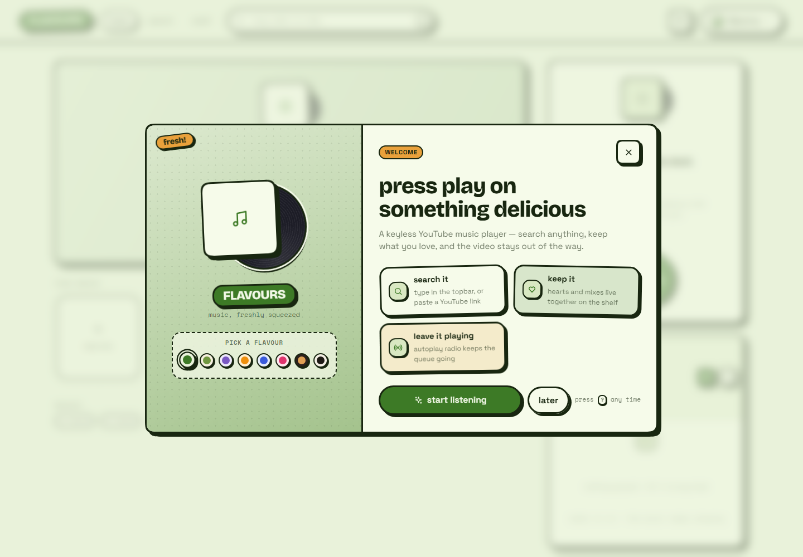
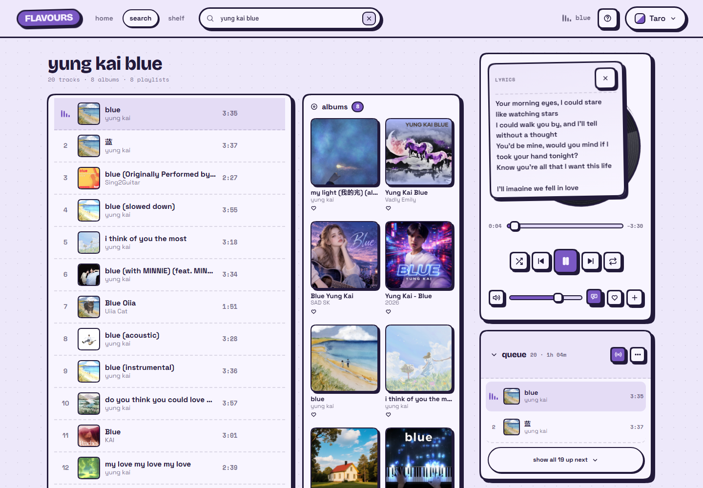
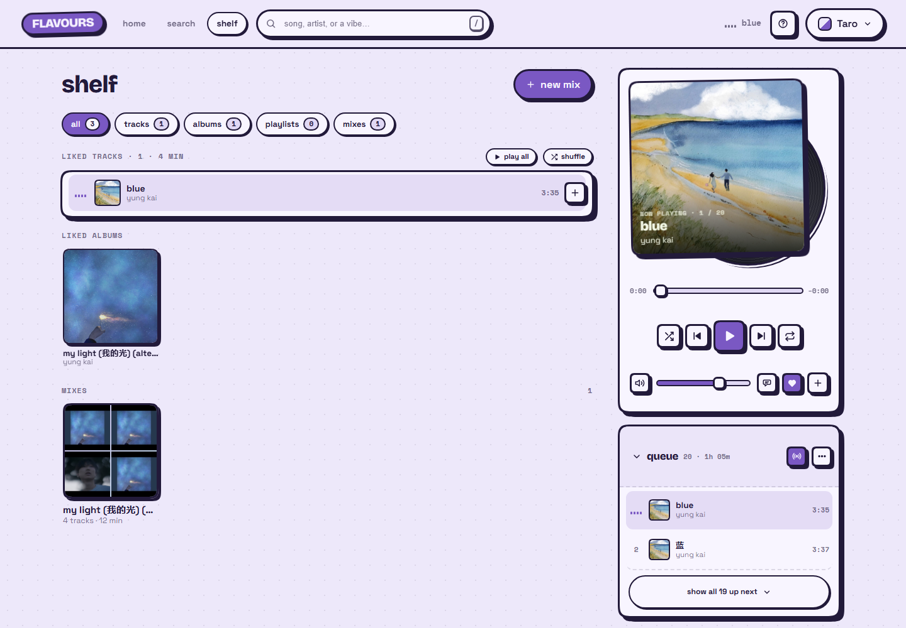

# 🍵 FLAVOURS

**Music, freshly squeezed.** A flavourful YouTube-powered music player — search anything, play it like a real music app, and the video stays out of the way until you want it.

Born from a simple problem: no Spotify at work, but YouTube works fine.



## Features

- **Search anything on YouTube** — keyless, powered by YouTube Music's internal API (clean artist / title / duration / square album art), with a regular YouTube fallback for the long tail
- **Search in two gears** — the field lives in the topbar and results float under it as you type (playable inline, ↑↓ · ↵ · esc); hit ↵ and it commits to a real `/search?q=` page you can refresh, bookmark and go back from
- **Albums & playlists** — search also returns album and playlist results; clicking one opens its own page (track list, play, shuffle, like, save as a mix, per-track add). Playing it lands the *album* in recently played, not just its first song
- **Mixes** — your own playlists: create, add from anywhere (every result row has an add menu), reorder, rename, delete, or save a whole album in one tap. Local-first, snapshotted, no account
- **Lucky** — plays the top hit immediately, `"artist - song"` style queries just work
- **Paste a YouTube link** — a video plays straight away, a playlist loads the whole list into the queue
- **Autoplay radio** — when the queue runs dry, YouTube Music's "up next" keeps the music going (toggle it in the queue header, or top up on demand)
- **Real player feel** — queue, play-next, shuffle, repeat, seek, volume, keyboard shortcuts
- **Drag-to-reorder** — queue and mix tracklists
- **Icon set, no emoji** — every control is a hand-drawn SVG in one `Icon.svelte`
- **Poster deck + up-next queue** — the rail holds a cover-forward deck with the record slipping out of the sleeve; when the queue opens the deck folds into a compact bar and the list takes the rail, so nothing is ever squeezed. The queue shows the current track plus the next one before you open it
- **Routed pages, one player** — home, search, the shelf; the deck and hidden video never unmount, so playback is never interrupted by navigation
- **Recently played** — the last dozen tracks you played, one tap away on home (and cleared when you clear them)
- **The shelf** — everything you keep in one place: liked tracks, liked albums and playlists, and your mixes, with filters (`all · tracks · albums · playlists · mixes`)
- **Likes** — heart tracks from the deck or `+` menu, and albums/playlists from their page or the search shelves
- **Lyrics** — the deck flips into a song sheet (`l`), straight from YouTube Music, with a gentle "no lyrics" note for videos outside the catalogue
- **Saved queues** — turn the whole queue into a mix with a name, from the queue's `⋯` menu
- **First-run tour** — a wide welcome poster on a fresh browser, with flavour swatches you can try on the spot; replayable from the cheat sheet
- **Backup** — export everything you've saved as one JSON file, import it on another machine
- **Hidden playback** — the video runs behind the scenes at 320×180, so it stays audio-first
- **Immersive mode** — one press and the *same* video animates into a big squircle frame. Never reloads, never interrupts the audio
- **OS media controls** — Media Session API gives you working media keys and title/artist/artwork in the system media hub
- **8 flavours** — Matcha, Pistachio, Taro, Mango, Blueberry, Strawberry, Espresso, Vanilla
- **Persistence** — queue, mixes, likes, volume, shuffle/repeat/radio and flavour survive reloads (localStorage)

| Immersive mode | Espresso, late night |
| --- | --- |
|  |  |

| Shortcut cheat sheet | Mobile layout |
| --- | --- |
|  |  |

| First run | Lyrics on the deck |
| --- | --- |
|  |  |

| The shelf |
| --- |
|  |

## Stack

- **SvelteKit** (Svelte 5 runes) + TypeScript
- **Plain CSS design system** (`src/app.css`) — smooth neo-brutalism: chunky ink borders, hard offset shadows, squircle corners (`corner-shape`), mono metadata
- **One inline SVG icon set** (`src/lib/components/Icon.svelte`) — no icon fonts, no emoji
- **YouTube IFrame Player API** for playback, one player instance, two layouts
- **`youtubei.js`** in the server routes — keyless search, up-next radio, link resolution and lyrics
- **Vercel** for hosting (adapter-vercel)

## Getting started

```bash
npm install
npm run dev      # http://localhost:5173
npm run check    # types + svelte diagnostics
```

No API keys, no `.env`, no accounts needed to run it.

## Keyboard shortcuts

| key | action |
| --- | --- |
| `space` / `k` | play / pause |
| `←` `→` | seek ±5s |
| `↑` `↓` | volume |
| `n` / `p` | next / previous track |
| `m` | mute |
| `s` | shuffle |
| `r` | repeat mode |
| `f` | toggle immersive mode |
| `l` | lyrics |
| `/` | focus search |
| `?` | keyboard cheat sheet |
| `esc` | close overlays |

## Project layout

```
src/
├── app.css                     # design tokens, 8 flavour palettes, brutalist primitives
├── app.html                    # fonts + no-flash theme bootstrap
├── lib/
│   ├── components/             # NowPlaying (poster deck), QueuePanel (up-next +
│   │                           # full list), SearchField (topbar field + floating
│   │                           # results), ResultsList, TrackMenu (add/queue/mix),
│   │                           # MixTile, Tile, MiniPlayer, VideoDock, Icon,
│   │                           # Onboarding, Shortcuts, FlavourPicker, Toaster
│   ├── player.svelte.ts        # the player controller: queue + transport + radio + YouTube wiring
│   ├── search.svelte.ts        # client search state (text queries and pasted links)
│   ├── mixes.svelte.ts         # user-made mixes, persisted snapshots
│   ├── likes.svelte.ts         # liked tracks and albums/playlists, persisted
│   ├── history.svelte.ts       # recently played: tracks and albums/playlists, persisted
│   ├── lyrics.svelte.ts        # lyric sheet state + session cache
│   ├── onboarding.svelte.ts    # the first-run tour, remembered per browser
│   ├── backup.ts               # export/import every `flavour:` key as JSON
│   ├── ui.svelte.ts            # deck/queue accordion state, persisted
│   ├── theme.svelte.ts         # flavour switching + persistence
│   ├── lucky.ts                # the lucky button's seed — your own history, never a fixed list
│   ├── youtube.ts              # YouTube link parsing (shared client/server)
│   ├── mediaSession.ts         # OS media controls
│   ├── format.ts               # time formatting, title cleanup
│   ├── flavours.ts             # flavour metadata
│   ├── server/yt.ts            # shared Innertube client + track mappers
│   ├── server/cache.ts         # in-process memo for warm function instances
│   └── yt/loader.ts            # one-time IFrame API loader + minimal typings
└── routes/
    ├── +layout.svelte          # shell: topbar nav + search, persistent deck/queue rail
    ├── +page.svelte            # home: jump back in, liked, recommended, your mixes, backup
    ├── search/+page.svelte     # committed search results (/search?q=…)
    ├── shelf/+page.svelte      # the shelf: liked tracks/albums/playlists + mixes, filtered
    ├── collection/[kind]/[id]/+page.svelte # one album or playlist: play, shuffle, like, save as a mix
    ├── mixes/+page.ts          # /mixes redirects to the shelf
    ├── mixes/[id]/+page.svelte # one mix: play, reorder, rename, delete
    └── api/
        ├── search/+server.ts   # keyless search (YouTube Music + fallback) + album/playlist shelves
        ├── collection/+server.ts # album/playlist header + tracks
        ├── radio/+server.ts    # up-next radio for the current video
        ├── lyrics/+server.ts   # lyrics for the current track
        └── resolve/+server.ts  # pasted video/playlist links → tracks
```

## Notes

- **Ads** still play inside the embed, and they can't be skipped while the player is hidden. An adblocker or a signed-in Premium session helps
- Embed-restricted / region-blocked videos are **skipped automatically** with a toast
- **Mobile browsers** may pause background playback when the screen locks — that's a browser limitation, not the app
- Everything you save lives in this browser (`localStorage`); home → backup exports it as one JSON file
- `static/robots.txt` disallows indexing — this is a personal toy, not a public service

## License

MIT © sehaz — fork it, remix it, ship it, just keep the copyright notice.

The licence covers this codebase only. Everything the app plays is streamed from YouTube and remains YouTube's (and its rights holders') — Flavours ships no media of its own.
